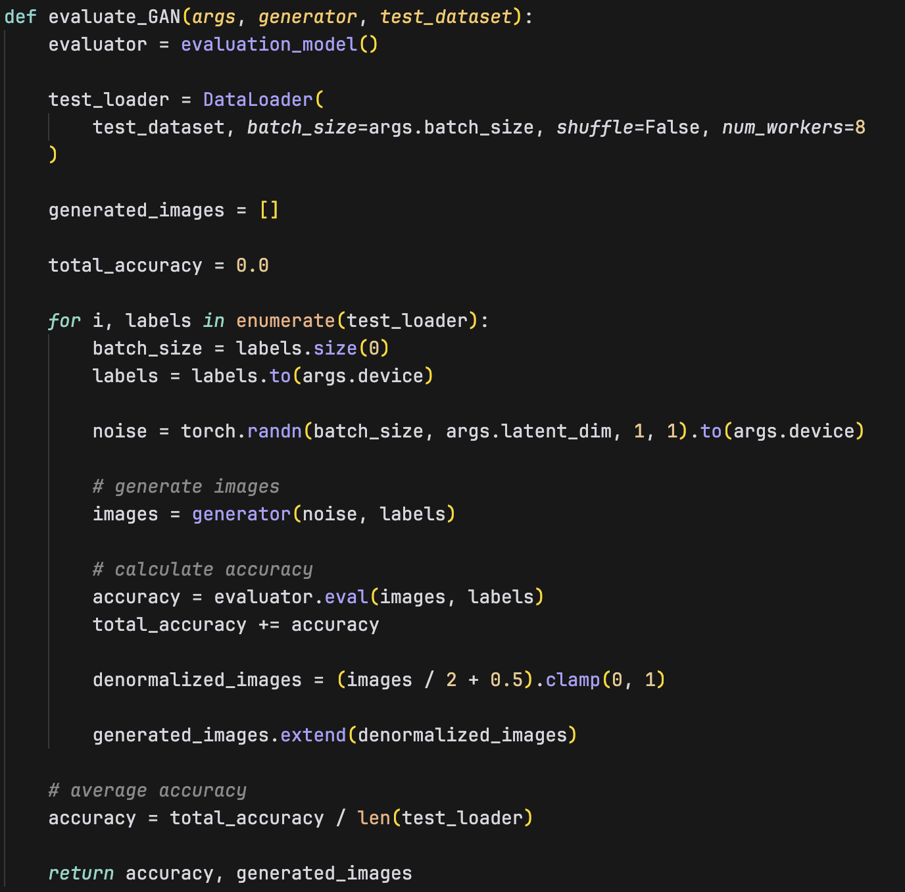
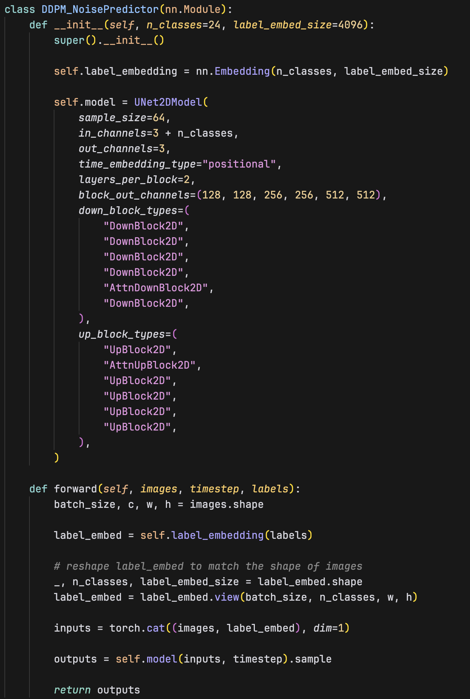

# DLP Lab 6

## Introduction
In Lab 6, we implement Conditional Generative Adversarial Networks (cGAN) and Conditional Denoising Diffusion Probabilistic Models (cDDPM) to generate synthetic images based on labels using the i-CLEVR dataset. This dataset contains images of 3D shapes with various colors and sizes.

The cGAN model consists of a generator that creates images from noise and labels, and a discriminator that distinguishes real from synthetic images, both conditioned on labels. The models are trained iteratively, improving their performance in generating and distinguishing images.

The cDDPM model uses a diffusion process to generate images, transforming random noise into structured images based on the labels provided. This process is learned during training to accurately generate labeled images.

Both models are evaluated on their ability to generate accurate synthetic images, and their outputs are assessed using a pre-trained classifier. Finally, we discuss the advantages and disadvantages of each model and propose potential improvements.

Here's the architecture of the GAN and DDPM model:

## Implementation details
### Conditional GAN
For the conditional GAN model, I use DCGAN architecture and modify it to take additional labels as condition input. The implementation involves two main components: the generator and the discriminator. 

First, the Generator takes random noise and labels as input. The input is then passed through a series of convolutional layers followed by batch normalization and ReLU activation functions. 
The image is being upsampled using transposed convolutional layers to produce a 64x64 image with three channels representing RGB values as the final output.

Second, the Discriminator takes an image and labels as input. The input is first concatenated with the labels and passed through a series of convolutional layers followed by batch normalization and LeakyReLU activation functions. Finally, the Sigmoid function is applied to the output to produce a single value representing the probability that the image is real.

The training process involves alternating between training the generator and the discriminator. 
First, we define the loss function using the Binary Cross Entropy loss on the discriminator's output and the ground truth labels (real or fake).
Then, we use Adam optimizer to update the weights of the generator and discriminator based on the loss. The beta1 and beta2 parameters are set to 0.5 and 0.999.

In the training loop, we first train the discriminator. We first feed the real images obtained from the dataset with their corresponding condition label. The discriminator is then updated immediately. Then, we train the discriminator with the fake images. The fake images are generated by the generator using random noise. The discriminator is then updated again.

Next, we train the generator. We use the fake images to feed it into the discriminator and try to fool the discriminator to think it's real. We then compute the BCE loss of the discriminator output and the ground truth label we want to achieve. The label here is set to 1 (real image) as we hope that the discriminator will be fooled by the fake images. The generator is then updated based on the loss.

 

The testing phase of GAN is relatively simple, we first sample a random noise and get the condition label as the initial inputs to the generator. The generator then directly generates the predicted image.

### Conditional DDPM
For the conditional DDPM model, I use the HuggingFace diffusers library to construct a UNet model that takes the t+1 noisy image and labels as input and predict the noise of the image. The predicted noise is then subtracted from the t+1 noisy image to obtain the t image. The denoising process is repeated for 1000 timestamps to generate the final image.

First, the input images are concatenated with the encoded labels and passed through the UNet model to predict the noise of the image. Then, the input is passed through the decoder to generate the predicted noise.
For the UNet model, I use the UNet2DModel from the HuggingFace diffusers library. I use 5 downsampling blocks and 5 upsampling blocks, each has one attention block to capture long-range dependencies in the image. For every block, there are 2 convolutional layers.

The training process is shown in the below figures. We define the DDPM noise scheduler using the DDPMScheduler from the HuggingFace diffusers library. The num_train_timestamps is set to 1000, and we use a "squaredcos_cap_v2" beta_schedule.
The Squared Cosine Schedule's variance of the noise follows a squared cosine function, leading to a smoother and more gradual diffusion process that helps the model learn the denoising steps more effectively. We use a cosine learning rate scheduler that, during the initial phase of training, the learning rate starts from a very low value and gradually increases to the specified maximum learning rate. The num_warmup_steps is set to 500. And for the loss function, Mean Squared Error (MSE) loss is used to compute the difference between the predicted noise and the ground truth noise.

In the training loop, we first use the noise scheduler to add a right amount of random noise based on the timestep to the image. Then, the noisy image, along with the timesteps, and labels are passed through the DDPM model to predict the noise that was added. The model's goal is to learn to accurately predict the noise added to the images. And finally, the MSE loss is computed between the predicted noise and the ground truth noise. The model is then updated based on the loss.

 

During the testing phase, we first sample a random noise and get the condition label as the initial inputs to the diffusion model. Then, we follow the timestep, which is the same as in the training phase, to predict the noise. Next, the DDPMScheduler helps subtract the predicted noise from the image to generate the final image. Here, the prev_sample gets the denoised image. The denoising process is repeated for 1000 timesteps until we get the final clear image.

## Results and discussions
### Results
#### GAN
Accuracy:
- test: **72.22%**
- new_test: **69.05%**
    

Synthetic image grids:
  - test:
    
  - new_test:
    

#### DDPM
Accuracy:
- test: **86.11%**
- new_test: **85.71%**
    

Synthetic image grids:
  - test:
    
  - new_test:
    

Denoising process image:
    

### Comparison of GAN and DDPM models
GAN can be efficient in training, often requiring fewer training epochs to reach the capacity to produce high-quality images. However, the adversarial learning also introduces instability in the training process, which can lead to mode collapse or poor convergence. The model is also sensitive to hyperparameters and requires careful tuning to achieve good results.

DDPM is generally more stable compared to GAN, as it does not include adversarial training. The model is also more interpretable, as it predicts the noise added to the image, which can be visualized and analyzed. However, DDPM requires more training epochs to learn the denoising process effectively, and the training process can be computationally expensive. In terms of generation capacity, DDPM can produce a more diverse range of images compared to GAN.

### Discussion of extra implementations or experiments
In GAN, I first tried using 1e-3 learning rate on both the generator and the discriminator with DCGAN. The training process immediately diverged into the discriminator being 100% correct, and the generator being 0% correct. After that, I tried using 1e-4 learning rate on both the generator and the discriminator and the training process went smoothly since. Also, I tried setting different latent dimension other than what the paper suggested, which is 100. I tried using 300 and 64 latent dimensions, and the results are shown below.

| batch size | ngf     | ndf     | latent_dim | test accuracy |
| ---------- | ------- | ------- | ---------- | ------------- |
| 64         | 300     | 100     | 100        | 61.99%        |
| **32**     | **300** | **100** | **100**    | **72.22%**    |
| 64         | 64      | 64      | 100        | 53.29%        |
| 32         | 64      | 64      | 100        | 60.45%        |

I find GAN to be more difficult to train compared to DDPM. During training, the losses fluctuate larger than that in DDPM. GAN requires careful tuning of hyperparameters to achieve good results. On the other hand, DDPM is more stable and easier to train.

In DDPM, I also tried different timesteps of the noise scheduler. I tried using fewer (500) timesteps than the default 1000 steps. The results are worse than the default 1000 timesteps with test accuracy around 55%. I suspect that the model needs more timesteps to gradually predict the noise, and using fewer timesteps means that the model is forced to make a greater leap in predicting the noise, thus, resulting in unstable prediction. And with 1000 timesteps, the model is able to perform better with a test accuracy of 86.11%.

## References
- https://pytorch.org/tutorials/beginner/dcgan_faces_tutorial.html#what-is-a-dcgan
- https://github.com/dnyanshwalwadkar/Advance-Deep-Learning/tree/main/GAN_Everything_A_Z
- https://huggingface.co/docs/diffusers/en/api/schedulers/ddpm
- https://huggingface.co/docs/diffusers/en/api/models/unet2d
